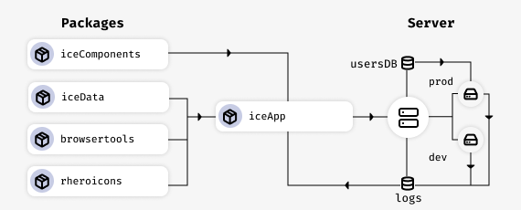

# In Control of Effects

The **In Control of Effects** project aims to develop a web application that provides antipsychotic medication recommendations based on side effects that an individual would like to avoid. The goal is to initiate a discussion between the individual and their psychiatrist regarding antipsychotic medications and the risk of side effects.

The primary output of this project is a [shiny application](https://shiny.rstudio.com) that provides antipsychotic medication recommendations based on an individual's preference for avoiding side effects. This application &mdash; the In Control of Effects app, or `iceApp` for short &mdash; is bundled into an R package and was built using several custom R packages, which are listed below.

- [iceApp](https://github.com/InControlofEffects/iceApp): The primary shiny application bundled into an R package.
- [iceData](https://github.com/InControlofEffects/iceData): an R package containing the primary dataset and user preferences function
- [iceComponents](https://github.com/InControlofEffects/iceComponents): all custom Shiny UI components were bundled into an R package
- [browsertools](https://github.com/davidruvolo51/browsertools): a package for communication between R and the client
- [rheroicons](https://github.com/davidruvolo51/rheroicons): the Heroicons library for R; an inline SVG icon library

> **Note**: Some of the projects are set to private while we are still making changes and validating the datasets, as well as feedback from collaborators. Check back later for updates!

To illustrate how these packages fit within the application, and the project itself, have a look at the following diagram.

In addition, the project created a website to learn more about the application. The site is live @ [www.incontrolofeffects.com](https://incontrolofeffects.com).

## Disclaimer

The **In Control of Effects** project and all related packages created are part of ongoing research led by researchers at the University of Oxford. Each tool produced by the In Control of Effects project does not replace medical treatment or consultation with any healthcare professional. Any information produced by this tool should be discussed with an individual's psychiatrist or other healthcare provider as this app does not take into account individual patient characteristics, pre-existing medical conditions, any current medical treatment or medications may already be prescribed. Any concerns in regard to side effects, medications, or anything related to medical treatment should be discussed a healthcare provider.

## References

1. Huhn, M., Nikolakopoulou, A., Schneider-Thoma, J., Krause, M., Samara, M., Peter, N., ... & Davis, J. (2019). Comparative efficacy and tolerability of 32 oral antipsychotics for the acute treatment of adults with multi-episode schizophrenia: a systematic review and network meta-analysis. The Lancet, 394(10202), 939-951. [http://dx.doi.org/10.1016/S0140-6736(19)31135-3](http://dx.doi.org/10.1016/S0140-6736(19)31135-3)

2. Henshall, C., Cipriani, A., Ruvolo, D., Macdonald, O., Wolters, L., & Koychev, I. (2019). Implementing a digital clinical decision support tool for side effects of antipsychotics: a focus group study. Evidence-Based Mental Health (22), 56-60. [http://dx.doi.org/10.1136/ebmental-2019-300086](http://dx.doi.org/10.1136/ebmental-2019-300086)